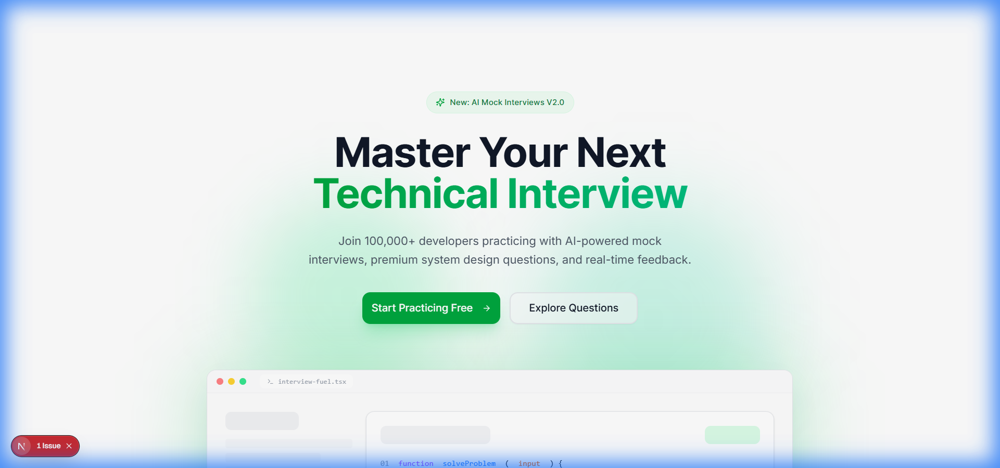
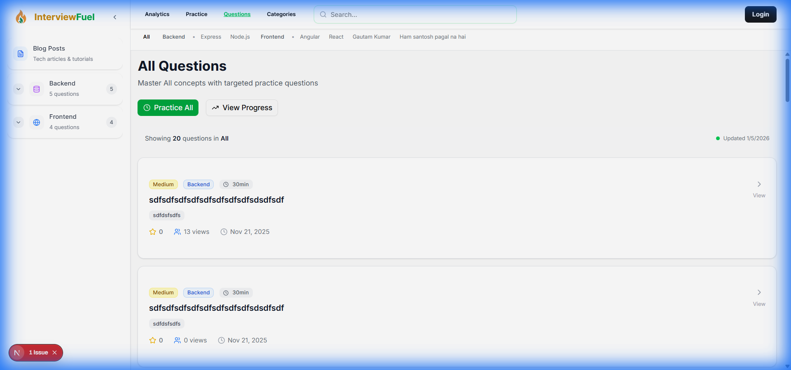
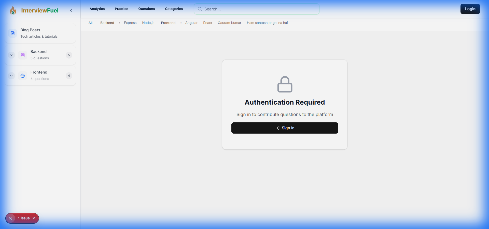
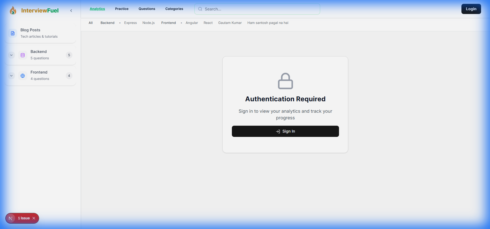

# InterviewFuel Frontend

> Next.js 15 frontend application for the InterviewFuel interview preparation platform.

## 🚀 Tech Stack

- **Framework**: Next.js 15.5 (App Router)
- **Language**: TypeScript 5.8
- **Styling**: Tailwind CSS 4.1
- **UI Components**: Radix UI
- **Rich Text Editor**: TipTap
- **State Management**: React Query
- **Authentication**: NextAuth
- **Icons**: Lucide React
- **Charts**: Recharts
- **Animations**: Motion (Framer Motion)

## 📦 Installation

1. **Install dependencies**
   ```bash
   npm install
   ```

2. **Set up environment variables**
   
   Create a `.env.local` file in the root directory:
   ```env
   NEXT_PUBLIC_API_URL=http://localhost:5000/api
   NEXTAUTH_URL=http://localhost:3000
   NEXTAUTH_SECRET=your-nextauth-secret
   NEXT_PUBLIC_APP_NAME=InterviewFuel
   ```

3. **Run the development server**
   ```bash
   npm run dev
   ```

4. **Open your browser**
   
   Navigate to [http://localhost:3000](http://localhost:3000)

## 📁 Project Structure

```
frontend/
├── app/                      # Next.js App Router
│   ├── (auth)/              # Auth pages (login, register)
│   ├── (dashboard)/         # Main app pages
│   │   ├── blogs/          # Blog pages
│   │   ├── practice/       # Practice session pages
│   │   ├── profile/        # User profile
│   │   └── questions/      # Question pages
│   ├── api/                # API routes
│   ├── globals.css         # Global styles
│   ├── layout.tsx          # Root layout
│   └── page.tsx            # Homepage
├── components/
│   ├── ui/                 # Reusable UI components
│   ├── custom/             # Custom components
│   ├── screens/            # Page components
│   └── common/             # Shared components
├── services/               # API service layer
├── hooks/                  # Custom React hooks
├── context/                # React Context
├── lib/                    # Utilities
├── types/                  # TypeScript types
├── constants/              # App constants
├── public/                 # Static files
└── styles/                 # Additional styles
```

## 🛠️ Available Scripts

```bash
# Development
npm run dev           # Start dev server (port 3000)

# Build
npm run build         # Build for production
npm run start         # Start production server

# Code Quality
npm run lint          # Run ESLint
npm run lint:fix      # Fix ESLint errors
npm run type-check    # Run TypeScript compiler check
```

## 🎨 Features

### Core Features
- **Server-Side Rendering (SSR)**: Optimized page loads
- **Static Site Generation (SSG)**: Pre-rendered pages
- **API Routes**: Backend integration
- **Dynamic Routing**: File-based routing
- **Image Optimization**: Next.js Image component
- **Font Optimization**: Automatic font loading

### UI/UX Features
- **Responsive Design**: Mobile-first approach
- **Dark Mode**: System-aware theme switcher
- **Rich Text Editor**: TipTap for blogs and comments
- **Skeleton Loaders**: Better loading states
- **Toast Notifications**: User feedback
- **Modal Dialogs**: Radix UI dialogs
- **Animations**: Smooth transitions with Motion

### Performance
- **Code Splitting**: Automatic route-based splitting
- **Lazy Loading**: Dynamic imports for heavy components
- **React Query**: Efficient data fetching and caching
- **Optimized Images**: WebP format with lazy loading
- **Prefetching**: Smart link prefetching

## � App Screenshots

<div align="center">
  <h3>Landing Page</h3>
  

  <h3>Question List</h3>
  

  <h3>Create Question (Protected)</h3>
  

  <h3>Analytics Dashboard (Protected)</h3>
  
</div>

## �🔌 API Integration

The frontend communicates with the backend API through service files located in the `services/` directory:

- `authservices/`: Authentication services
- `categories/`: Category management
- `practiceservices/`: Practice session handling
- `blog-services.ts`: Blog operations
- `search-services.ts`: Search functionality
- `stats-services.ts`: Analytics and statistics

Example usage:
```typescript
import blogService from '@/services/blog-services';

// Fetch all blogs
const { data } = await blogService.getAllBlogs({
  page: 1,
  limit: 10,
  category: 'frontend'
});
```

## 🎯 Key Pages

| Route | Description |
|-------|-------------|
| `/` | Homepage with featured content |
| `/questions` | Question browser with filters |
| `/questions/[id]` | Question detail page |
| `/practice` | Practice session page |
| `/blogs` | Blog listing page |
| `/blogs/[slug]` | Blog detail page |
| `/blogs/create` | Create new blog post |
| `/profile` | User profile and settings |
| `/login` | Login page |
| `/register` | Registration page |

## 🧩 Component Library

### UI Components (`components/ui/`)
- `button`, `input`, `textarea` - Form elements
- `card`, `dialog`, `dropdown-menu` - Layout components
- `select`, `switch`, `slider` - Interactive controls
- `avatar`, `badge`, `tooltip` - Display elements
- `rich-text-editor` - TipTap editor wrapper

### Custom Components (`components/custom/`)
- `customsidebar/` - Navigation sidebar
- `CategoryNavbar` - Category navigation
- `QuestionCard` - Question display
- `BlogCard` - Blog post card
- `PracticeTimer` - Session timer

## 🌐 Environment Variables

```env
# Required
NEXT_PUBLIC_API_URL=          # Backend API URL
NEXTAUTH_URL=                 # App URL for NextAuth
NEXTAUTH_SECRET=              # NextAuth encryption key

# Optional
NEXT_PUBLIC_APP_NAME=         # App display name
NEXT_PUBLIC_APP_URL=          # Public app URL
```

## 🎨 Styling

### Tailwind Configuration
- Custom color palette
- Dark mode support
- Custom animations
- Extended spacing and sizing
- Custom font families

### CSS Variables
The app uses CSS variables for theming:
```css
--background
--foreground
--primary
--secondary
--muted
--accent
--destructive
```

## 🔐 Authentication

The app uses NextAuth for authentication:
- JWT-based sessions
- Credential provider
- Protected routes with middleware
- Automatic token refresh
- Secure cookie storage

## 📱 Responsive Breakpoints

```javascript
sm: '640px'   // Small devices
md: '768px'   // Medium devices
lg: '1024px'  // Large devices
xl: '1280px'  // Extra large devices
2xl: '1536px' // 2X large devices
```

## 🚀 Deployment

### Vercel (Recommended)
```bash
# Install Vercel CLI
npm i -g vercel

# Deploy
vercel
```

### Manual Deployment
```bash
# Build
npm run build

# Start production server
npm start
```

## 🐛 Troubleshooting

### Common Issues

**Issue**: `Module not found` errors
- **Solution**: Clear `.next` folder and reinstall dependencies
  ```bash
  rm -rf .next node_modules
  npm install
  ```

**Issue**: Environment variables not loading
- **Solution**: Ensure variables are prefixed with `NEXT_PUBLIC_` for client-side access

**Issue**: Dark mode not working
- **Solution**: Check theme provider is wrapping your app in `layout.tsx`

## 📚 Learn More

- [Next.js Documentation](https://nextjs.org/docs)
- [Tailwind CSS Documentation](https://tailwindcss.com/docs)
- [Radix UI Documentation](https://www.radix-ui.com/docs)
- [TipTap Documentation](https://tiptap.dev/docs)
- [React Query Documentation](https://tanstack.com/query/latest)

## 📄 License

MIT License - see the main [README](../README.md) for details.

---

<div align="center">
  <p>Part of the <a href="../README.md">InterviewFuel</a> project</p>
</div>

